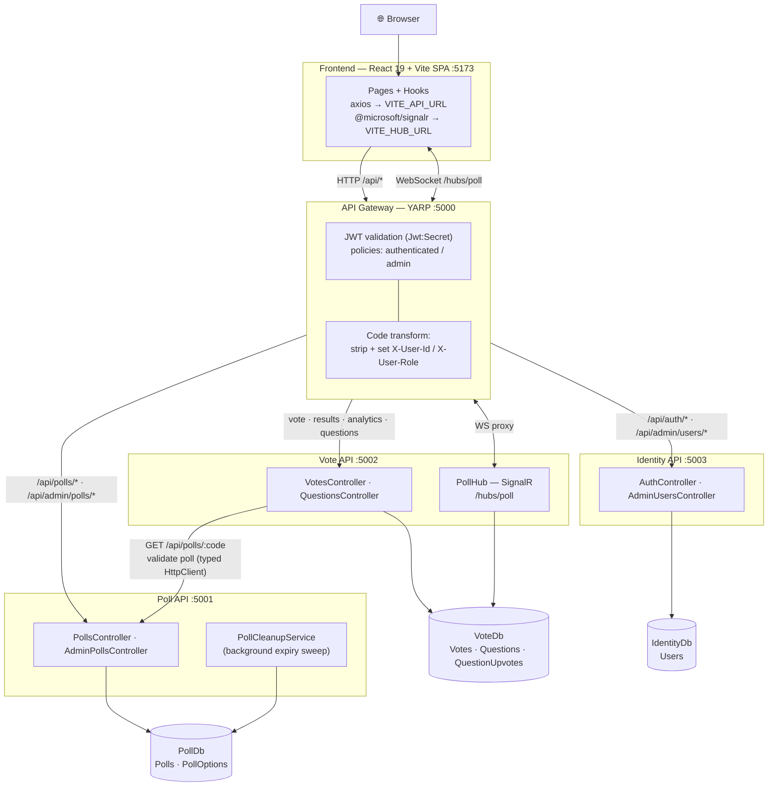
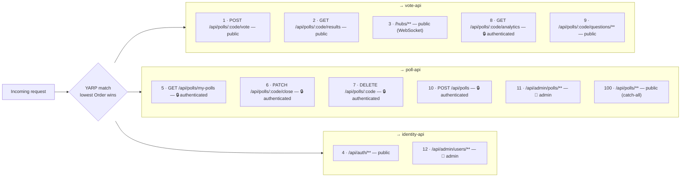
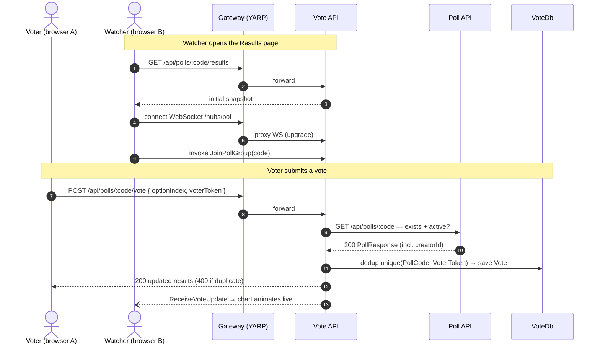
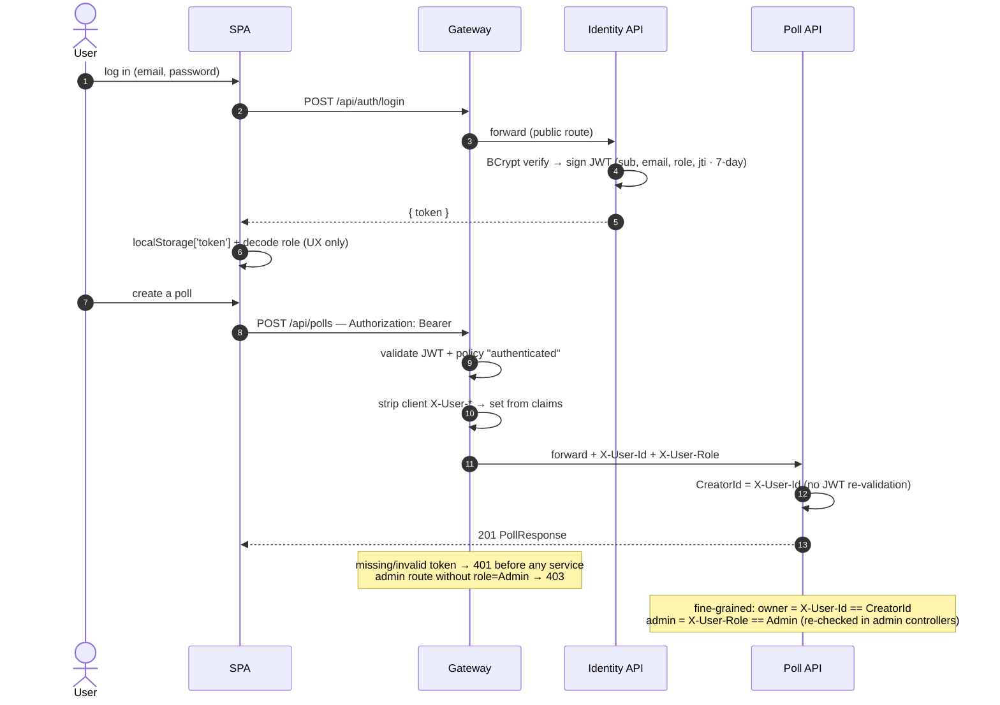
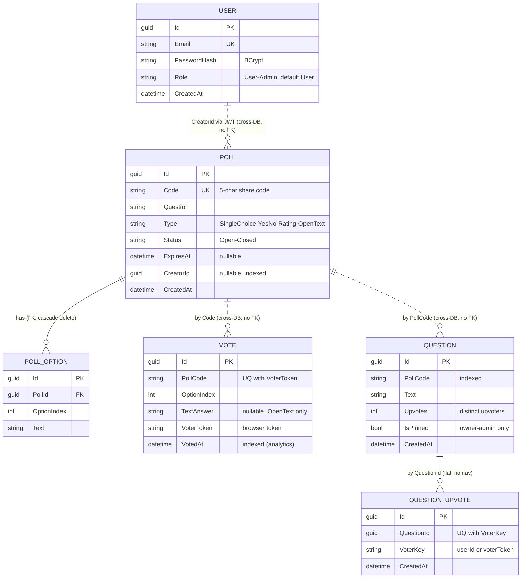
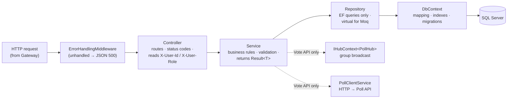
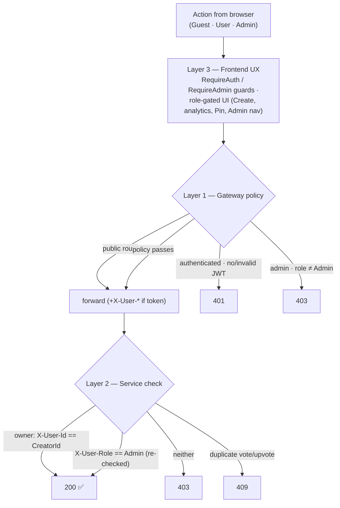
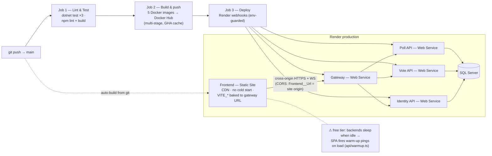

# Architecture Diagrams (Mermaid)

Mermaid versions of the system described in [ARCHITECTURE.md](../ARCHITECTURE.md) (the authoritative
source — if these ever disagree, that file wins). GitHub and VS Code (with Mermaid support) render
these natively; they're also handy for slides.

---

## 1. System topology (services, databases, real-time)

**Golden rule shown above:** each service touches only its own DB; the Vote API reaches poll data
via HTTP to the Poll API, never via PollDb.

---

## 2. Gateway routing (YARP route → cluster, with auth policy)

Every proxied request passes the **anti-spoof transform**: client-supplied `X-User-Id`/`X-User-Role`
are stripped, then re-set from the validated JWT's `sub`/`role` claims when a token is present.

---

## 3. Flow — vote submission + live results (SignalR)

---

## 4. Flow — authentication + protected request (RBAC)

---

## 5. Database schema (3 databases — dotted lines = logical refs, **no FK**)

DB ownership: `POLL`/`POLL_OPTION` → **PollDb**; `VOTE`/`QUESTION`/`QUESTION_UPVOTE` → **VoteDb**;
`USER` → **IdentityDb**. Dedup is enforced by unique indexes `(PollCode, VoterToken)` and
`(QuestionId, VoterKey)`.

---

## 6. Per-service internal layering (the request pipeline inside each service)

Exceptions: **Identity API** has no Repository layer (`AuthService`/`AdminService` use the DbContext
directly); the **Gateway** has none of these layers (YARP config only).

---

## 7. RBAC — layered enforcement (defense-in-depth)

The server is always authoritative — the frontend layer is UX-only.

---

## 8. CI/CD + production deployment (Render)

Migrations auto-apply on each service's startup (`Database.MigrateAsync()` with retry) — no manual
`dotnet ef database update` in any environment.
